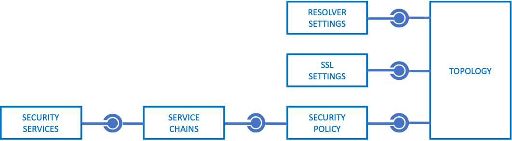

# F5 SSL Orchestrator Ansible Automation Collection
## _PREVIEW - Still in testing_

[](https://github.com/kevingstewart/f5_sslo_ansible/releases)

This collection provides a set of modules for automated configuration of the F5 SSL Orchestrator.
Documentation for individual modules is available in the [docs](docs/) folder.

## Support
This Ansible module collection currently supports SSL Orchestrator versions **5.0** to **9.0**, and the creation of the following types of objects:
- Security Services
  - Inline layer 2 security services
  - Inline layer 3 security services
  - Inline http security services
  - ICAP security services
  - TAP security services
  - SWG security services (9.0+)
- Configurations
  - Security service chains
  - Security policies
  - SSL configurations
  - DNS resolver configurations
- Topologies
  - Outbound layer 3 SSL Orchestrator topologies
  - Outbound explicit proxy SSL Orchestrator topologies
  - Inbound layer 3 SSL Orchestrator topologies
  - Outbound layer 2 SSL Orchestrator topologies
  - Inbound layer 2 SSL Orchestrator topologies

Note that this a `community` project, and as such **NOT** officially supported by F5 Networks. Please raise any issues discovered through the respository's [issues](https://github.com/kevingstewart/f5_sslo_ansible/issues) site, and those will be addressed in a timely manner.

## Requirements
The following software package versions are required:
- Python >= 3.8
- Ansible >= 2.10

## Installation
To install this collection: 
```bash
ansible-galaxy collection install git+https://github.com/kevingstewart/f5_sslo_ansible.git
```
You can also include it in a `requirements.yml` file and install it via `ansible-galaxy collection install -r requirements.yml` using the format:
```yaml
collections:
  - name: https://github.com/kevingstewart/f5_sslo_ansible.git
    type: git
```
## Required Python Libraries
These modules depend on the following third party libraries:
- f5-sdk
- bigsuds
- netaddr
- objectpath
- isoparser
- lxml
- deepdiff

## Additional Considerations
If deploying to a virtual (VE) environment, it will be useful to increase management plane memory provisioning on the BIG-IPs.
  ```bash
  tmsh modify sys db provision.extramb value 8192
  tmsh save sys config
  ```

## Setting up a simple lab environment
While not expressly required, the following steps utilize Python virtualenv on an Ubuntu 20.0+ box to build a simple development environment for this collection:
- Initial system configuration (install Python 3.8 and Virtualenv)
  ```bash
  sudo apt update
  sudo apt upgrade
  
  ** Test for Python3.8+. If less than, use following commands to install:
  python3 --version
  sudo apt install software-properties-common
  sudo add-apt-repository ppa:deadsnakes/ppa
  sudo apt install python3.8
  ```
- Virtualenv setup (install/activate Virtualenv, install Ansible, and install third party libraries)
  ```bash
  mkdir build && cd build
  sudo apt install python3.8-venv python3-venv
  python3 -m venv ansible_venv
  source ansible_venv/bin/activate
  pip3 install --upgrade pip
  pip3 install f5-sdk bigsuds netaddr objectpath isoparser lxml deepdiff
  pip3 install ansible
  ansible --version
  ```
- Module environment setup (install Ansible collections)
  ```bash
  mkdir ansible && cd ansible
  mkdir {inventory,playbooks}
  echo -e "[all]\nlocalhost" >> inventory/hosts
  echo -e "[defaults]\nhost_key_checking = False\nretry_files_enabled = False" >> ansible.cfg
  ansible-galaxy collection install git+https://github.com/kevingstewart/f5_sslo_ansible.git
  ```
- Grab a local copy of the sample playbooks (optional)
  ```Bash
  sudo apt install subversion
  svn export https://github.com/kevingstewart/f5_sslo_ansible/trunk/sample-playbooks --force
  ```
- Updates and fixes are getting posted regularly. To make sure you have the latest release:
  ```Bash
  ansible-galaxy collection install git+https://github.com/kevingstewart/f5_sslo_ansible.git -f
  ```

## Guiding Principles
SSL Orchestrator automation with Ansible requires the following guiding principles:
- **Object relationships**: Similar to Local Traffic Manager (LTM) components, SSL Orchestrator objects have an inherent parent-child relationship with other objects. For example, a security policy applies traffic flows to service chains, thus a defined service chain must exist before the policy is created. In an Ansible playbook this could be as simple as creating the service chain task _before_ the policy task.

  
  
  The notable exception to this rule is **Topology** creation, which can create all objects in a single process.

- **Strictness**: The SSL Orchestrator guided configuration (UI) is a workflow-driven process (i.e. wizard) that creates and manages all objects required for optimal configuration of a topology. This imposes a limitation on the ability to customize a configuration in order to maintain that optimal state, and this limitation is controlled by a **strictness** mechanism. In the UI, a lock icon represents strictness. Disabling strictness (unlocking the lock) allows for free customization of the different objects, but also moves the burden of configuration state to the administrator. In this Ansible collection, strictness is intentionally disabled for all objects to allow for advanced customization. This will in some instances prevent management of SSL Orchestrator objects from the UI (which in theory should not be necessary if one is relying on automation tools).

- **Reconciliation**: The SSL Orchestrator configuration is managed by a separate JSON-based block structure, independent of the native BIG-IP managed control plane (MCP) process. The SSL Orchestrator control plane then relies on a daemon to reconcile JSON configurations into MCP objects. This reconciliation process produces a short delay between committing a configuration and realization of the respective MCP objects. Thus, an SSL Orchestrator Ansible task will take longer to execute than typical BIG-IP tasks. SSL Orchestrator tasks must also be executed serially (one at-a-time).

## Usage
#### Playbooks
To use a module from this collection, add the full namespace and collection name in the `collections` element:

```YAML
---
- name: Create an SSLO service
  hosts: localhost
  gather_facts: False
  connection: local
  collections:
    - kevingstewart.f5_sslo_ansible
  vars: 
    provider:
      server: 172.16.1.77
      user: admin
      password: admin
      validate_certs: no
      server_port: 443
  tasks:
    - name: SSLO TAP service
      bigip_sslo_service_tap:
        provider: "{{ provider }}"
        name: "tap1"
        ...
```
#### Modules
The following modules are currently available:
| Module | Description |
| ------ | ------ |
| bigip_sslo_service_layer2         | Used to create/modify/delete an inline layer 2 security service |
| bigip_sslo_service_layer3         | Used to create/modify/delete an inline layer 3 security service |
| bigip_sslo_service_http           | Used to create/modify/delete an inline http (proxy) security service |
| bigip_sslo_service_icap           | Used to create/modify/delete an icap security service |
| bigip_sslo_service_tap            | Used to create/modify/delete a passive tap security service |
| bigip_sslo_service_swg            | Used to create/modify/delete an SWG security service |
| bigip_sslo_config_service_chain   | Used to create/modify/delete a security service chain |
| bigip_sslo_config_policy          | Used to create/modify/delete a security policy |
| bigip_sslo_config_ssl             | Used to create/modify/delete an ssl configuration |
| bigip_sslo_config_resolver        | Used to create/modify/delete a DNS resolver configuration |
| bigip_sslo_config_topology        | Used to create/modify/delete an SSL Orchestrator topology |
| bigip_sslo_config_utility         | Used to perform various SSL Orchestrator utility functions |
| bigip_sslo_config_authentication  | Used to create/modify/delete an OCSP Authentication configuration |

Full documentation on each module can be found in the [docs](docs/) folder.

## License
GNU General Public License v3.0

See LICENSE to see the full text.


