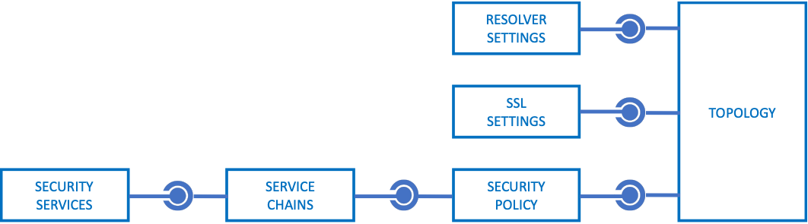

# F5 SSL Orchestrator Ansible Automation Collection
## Documentation

In this folder, find a separate markdown document for detailed instructions on each Ansible module in the collection.

| Module | Description |
| ------ | ------ |
| [bigip_sslo_service_layer2](bigip_sslo_service_layer2.rst)                 | Used to create/modify/delete an inline layer 2 security service |
| [bigip_sslo_service_layer3](bigip_sslo_service_layer3.rst)                 | Used to create/modify/delete an inline layer 3 security service |
| [bigip_sslo_service_http](bigip_sslo_service_http.rst)                     | Used to create/modify/delete an inline http (proxy) security service |
| [bigip_sslo_service_icap](bigip_sslo_service_icap.rst)                     | Used to create/modify/delete an icap security service |
| [bigip_sslo_service_tap](bigip_sslo_service_tap.rst)                       | Used to create/modify/delete a passive tap security service |
| [bigip_sslo_service_swg](bigip_sslo_service_swg.rst)                       | Used to create/modify/delete an SWG service |
| [bigip_sslo_config_service_chain](bigip_sslo_config_service_chain.rst)     | Used to create/modify/delete a security service chain |
| [bigip_sslo_config_policy](bigip_sslo_config_policy.rst)                   | Used to create/modify/delete a security policy |
| [bigip_sslo_config_ssl](bigip_sslo_config_ssl.rst)                         | Used to create/modify/delete an ssl configuration |
| [bigip_sslo_config_resolver](bigip_sslo_config_resolver.rst)               | Used to create/modify/delete a DNS resolver configuration |
| [bigip_sslo_config_topology](bigip_sslo_config_topology.rst)               | Used to create/modify/delete an SSL Orchestrator topology |
| [bigip_sslo_config_utility](bigip_sslo_config_utility.rst)                 | Used to perform various SSL Orchestrator utility functions |
| [bigip_sslo_config_authentication](bigip_sslo_config_authentication.rst)   | Used to create/modify/delete an authentication configuration |
 

SSL Orchestrator objects follow a similar hierarchical relationship as other F5 BIG-IP objects.

 

- **Security Services** are the third party security devices (ex. FireEye, Palo Alto NGFW, McAfee Web Gateway) that are attached to the SSL Orchestrator and receive decrypted traffic. A security device configuration is made up of a set of network objects (VLANs, self-IPs, route domains, etc.) and other native BIG-IP objects (virtual servers, pools, rules, profiles, etc.). From a configuration perspective, SSL Orchestrator encompasses all of these objects into a single service object container. A security service declaration will minimally require the name, type of service, and the specific network properties for that service (how it connects to the BIG-IP).
 

- **Service Chains** are ordered lists of security devices. A security service is functionally defined by a set of objects inside the security policy, and not a separate object in and of itself. A service chain declaration will minimally require the name of the chain, and an ordered list of services to include in the chain.
 

- **Security Policies** are the traffic rules that perform real-time traffic classification and orchestration of traffic flows to the security services. Functionally a security policy is a set of stateless per-session and per-request access policies attached to a topology. A security policy declaration will minimally include the name of the policy, policy type (inbound, outbound), and a list of traffic rules and corresponding actions (allow/block, TLS intercept/bypass, service chain).
 

- **SSL Settings** are the end-to-end settings for handling TLS decryption and re-encryption through a topology. Functionally SSL settings are the pair of client and server SSL profiles attached to a topology. An SSL settings declaration will minimally require the name of the configuration and specific client and server side TLS handling parameters.
 

- **Resolver Settings** are the globally-defined DNS resolution settings used by topologies, when needed. Functionally the resolver settings are defined as a netork Resolver object. A resolver declaration will minimally require necessary DNS forwarding/resolution parameters.
 

- **Topologies** are the container objects for all of the subordinate entities (policies, SSL, etc.) and defines the listening path for traffic flows (inbound, outbound, explicit). Functionally a topology is a virtual server, or set of virtual servers and the subordinate objects, specifically the security policy profiles and SSL profiles. Traffic flows to a topology based on listening path - the defined VLANs, source/destination/port filters, and flow type (inbound, outbound), is decrypted, processed by the security policy, service chains and security services, and then re-encrypted. A topology declaration will minimally require the name of the topology, topology type, listener and traffic flow properties, and SSL and security policy references. 
 

In most cases, Ansible declarations will be made in relationship order (ie. services -> service chains -> security policies -> topologies), and defined as separate tasks in a playbook. These objects can be configured independently as well. For example, an administrator may define a playbook to modify security policy settings in an existing topology. However, when creating the complete set of objects in a topology, there are generally two ways to handle this:
- **Atomic** creation - where each object is defined as a separate task. SSL Orchestrator objects are created and reconciled in series, so this operation could take an extended amount of time to complete.
- **Aggregate** creation - where a topology definition can consume the properties of all other subordinate objects and make a single creation call.

The specific of both of these options are detailed on the Topology documentation page.
